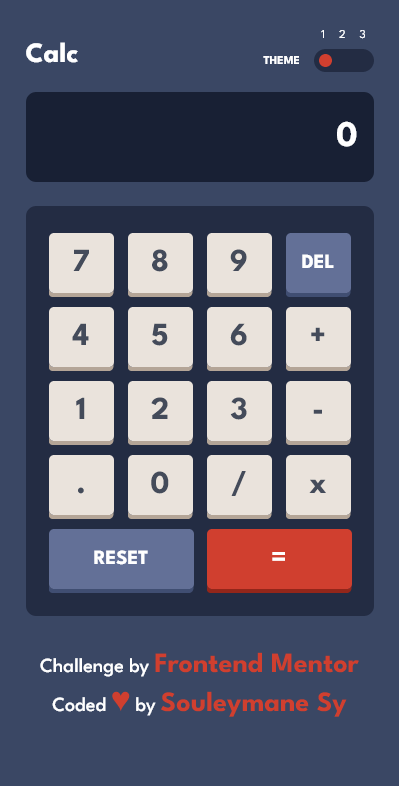
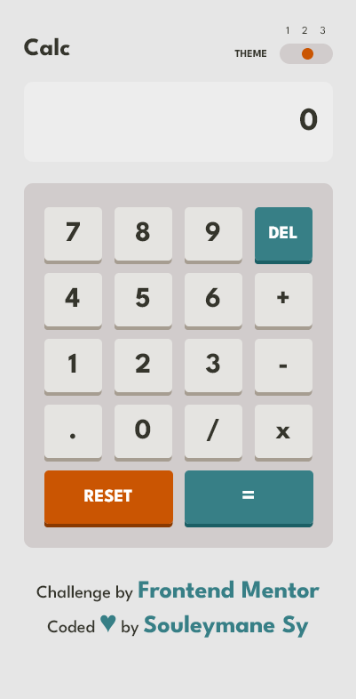
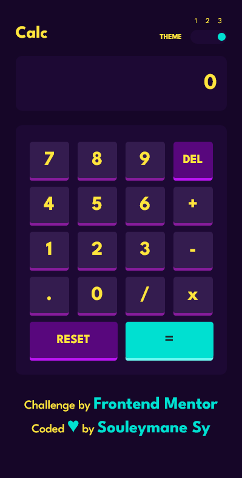
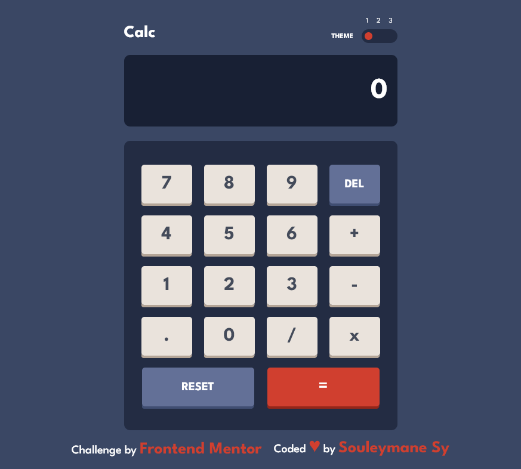
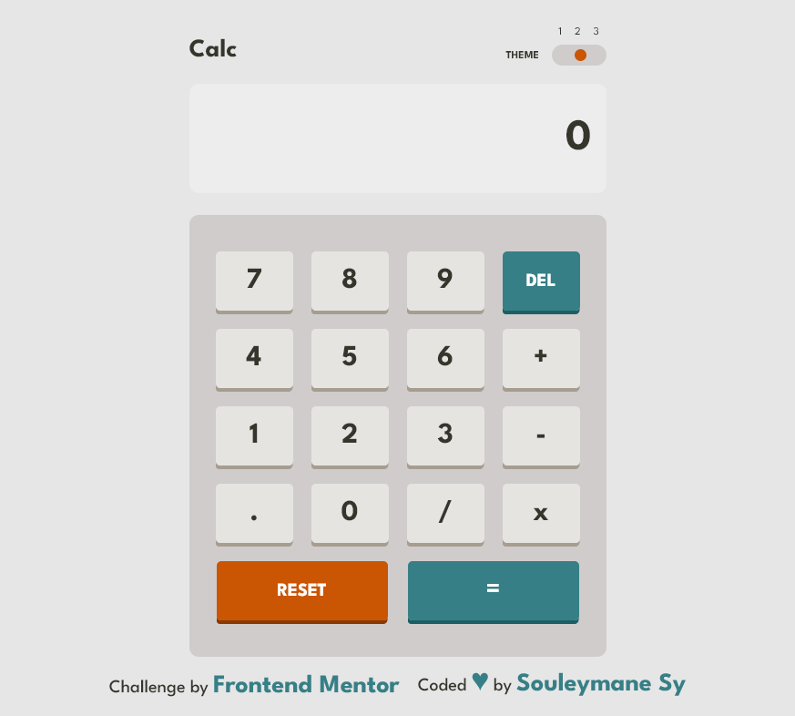
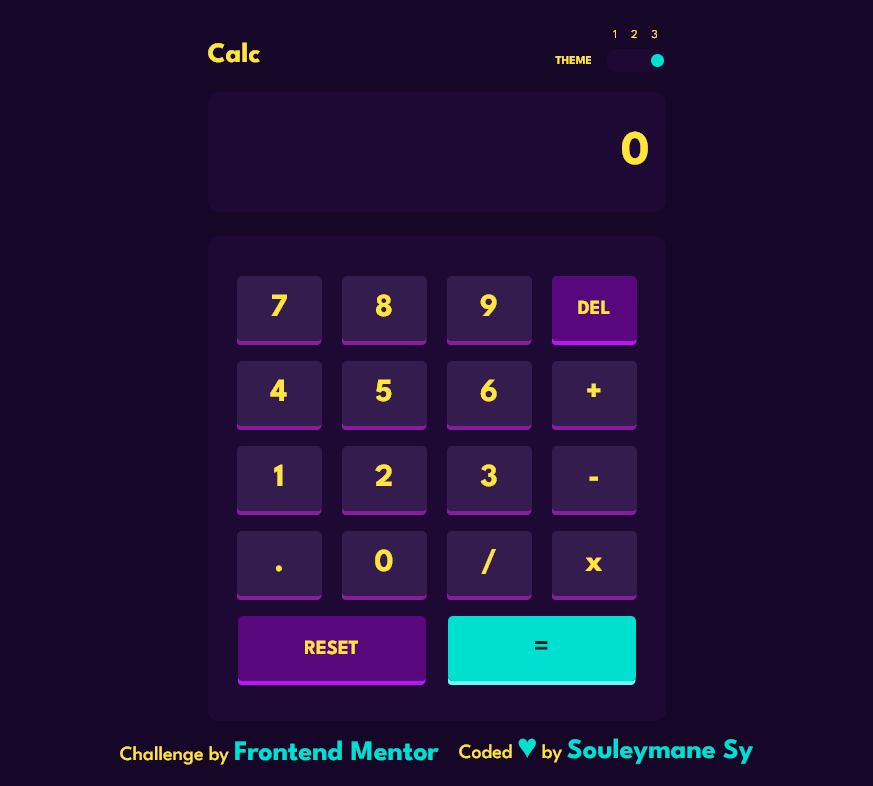
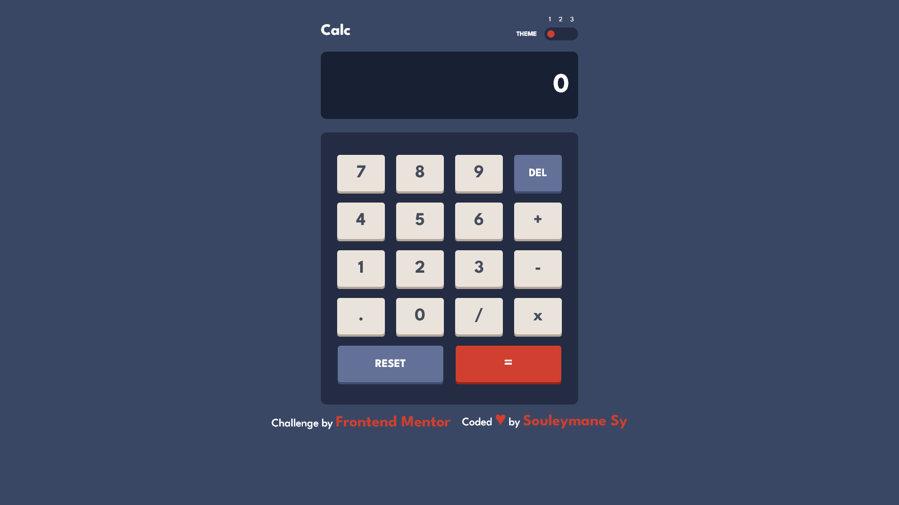
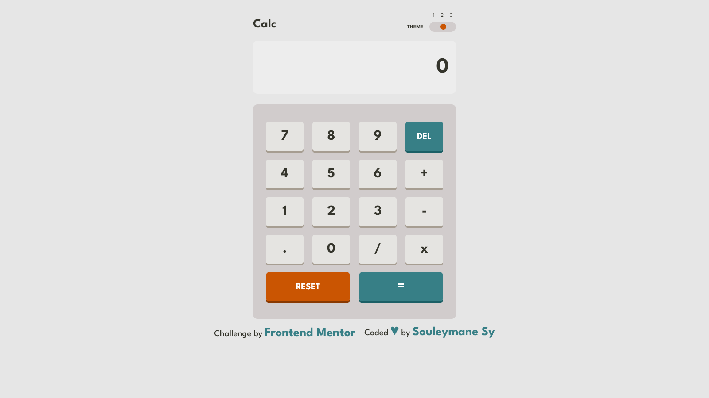
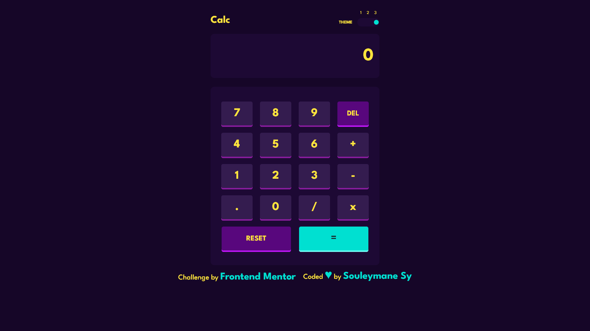

# Welcome! 👋

## Frontend Mentor - Calculator app solution

This is a solution to the [Calculator app challenge on Frontend Mentor](https://www.frontendmentor.io/challenges/calculator-app-9lteq5N29). Frontend Mentor challenges help you improve your coding skills by building realistic projects.

## Table of contents

- [Overview](#overview)
  - [The challenge](#the-challenge)
  - [Screenshot](#screenshot)
- [My process](#my-process)
  - [Built with](#built-with)
  - [What I learned](#what-i-learned)
  - [Continued development](#continued-development)
- [Author](#author)

## Overview

### The challenge

Users should be able to:

- See the size of the elements adjust based on their device's screen size
- Perform mathmatical operations like addition, subtraction, multiplication, and division
- Adjust the color theme based on their preference
- **Bonus**: Have their initial theme preference checked using `prefers-color-scheme` and have any additional changes saved in the browser

### Screenshot

This is the Screenshot of the projects a made!

### Mobile First Theme

### Mobile Second Theme

### Mobile Third Theme

### Tablets First Theme

### Tablets Second Theme

### Tablets Third Theme

### Desktops First Theme

### Desktop Second Theme

### Desktop Third Theme

### Links

- Solution URL: [Front-end Mentor Solution here](https://www.frontendmentor.io/solutions/calculator-app-5JZlDIAA-p)
- Live Site URL: [Live WebSite here](https://calculator-app-orcin-gamma.vercel.app/)

## My process

I am Learning Vue Js.
So, I made this project with Vue for some practice.

### Built with

- Semantic HTML5 markup
- CSS custom properties
- Flexbox
- CSS Grid
- SASS
- Mobile-first workflow
- [Vue Js](https://vuejs.org/) - JS Framework

### What I learned

Learned to work with Vue JS! And is so amazing to work with it.

### Continued development

I Want to be very very good with Vue JS!

## Author

- GitHub - [Souleymane Sy](https://github.com/SouleymaneSy7)
- Frontend Mentor - [@SouleymaneSy7](https://www.frontendmentor.io/profile/SouleymaneSy7)
- Twitter - [@Souleymanesy43](https://twitter.com/Souleymanesy43)
